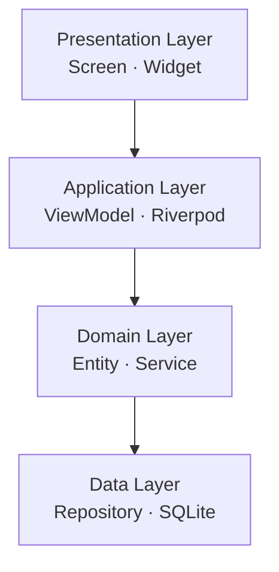
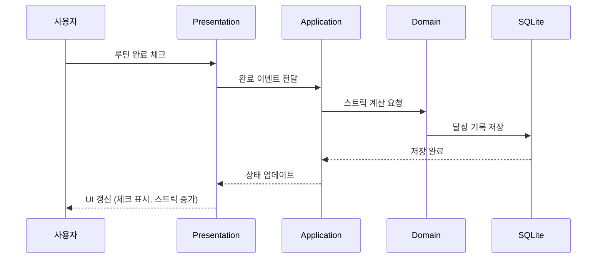
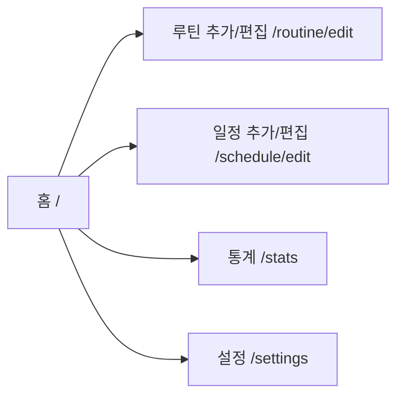

# DevFlow 아키텍처

## 개요

DevFlow는 개발자 전용 루틴/일정 관리 모바일 앱으로,
Flutter 기반의 레이어드 아키텍처로 설계되었다.
모든 데이터는 로컬 SQLite에 저장되며 외부 네트워크 의존 없이 동작한다.

---

## 레이어 구조



| 레이어 | 책임 | 주요 구성 요소 |
|---|---|---|
| Presentation | 화면 표시, 사용자 입력 처리 | Screen, Widget, Theme |
| Application | 상태 관리, 비즈니스 흐름 조율 | ViewModel, Riverpod Provider |
| Domain | 핵심 비즈니스 규칙 | Entity, Service (스트릭 계산, 업적 판정) |
| Data | 데이터 저장·조회 | Repository, SQLite (sqflite) |

---

## 데이터 흐름



---

## 디렉토리 구조

```
lib/
├── main.dart
├── app.dart
├── presentation/
│   ├── screens/
│   │   ├── home/
│   │   ├── routine/
│   │   ├── schedule/
│   │   ├── stats/
│   │   └── settings/
│   ├── widgets/
│   └── theme/
├── application/
│   └── view_models/
│       ├── routine_view_model.dart
│       ├── schedule_view_model.dart
│       └── stats_view_model.dart
├── domain/
│   ├── entities/
│   │   ├── routine.dart
│   │   ├── schedule.dart
│   │   └── achievement.dart
│   └── services/
│       ├── streak_service.dart
│       └── achievement_service.dart
└── data/
    ├── repositories/
    │   ├── routine_repository.dart
    │   └── schedule_repository.dart
    └── local/
        └── database_helper.dart
```

---

## 기술 스택

| 항목 | 선택 | 이유 |
|---|---|---|
| 플랫폼 | Flutter | 단일 코드베이스로 Android/iOS 동시 지원 |
| 상태관리 | Riverpod | 타입 안정성 높음, 테스트 용이 |
| 로컬 DB | SQLite (sqflite) | 외부 의존 없이 안정적, 오프라인 완전 지원 |
| 알림 | flutter_local_notifications | 로컬 푸시, 스케줄링 지원 |
| 차트 | fl_chart | Flutter 전용, 히트맵·라인차트 모두 지원 |

---

## 화면 목록 및 라우팅



| 화면 | 경로 | 설명 |
|---|---|---|
| 홈 | `/` | 오늘 루틴 카드 목록 + 일정 요약 |
| 루틴 추가/편집 | `/routine/edit` | 루틴 CRUD |
| 일정 추가/편집 | `/schedule/edit` | 일정 CRUD |
| 통계 | `/stats` | 히트맵, 스트릭, 달성률 차트 |
| 설정 | `/settings` | 테마, 알림 on/off |
