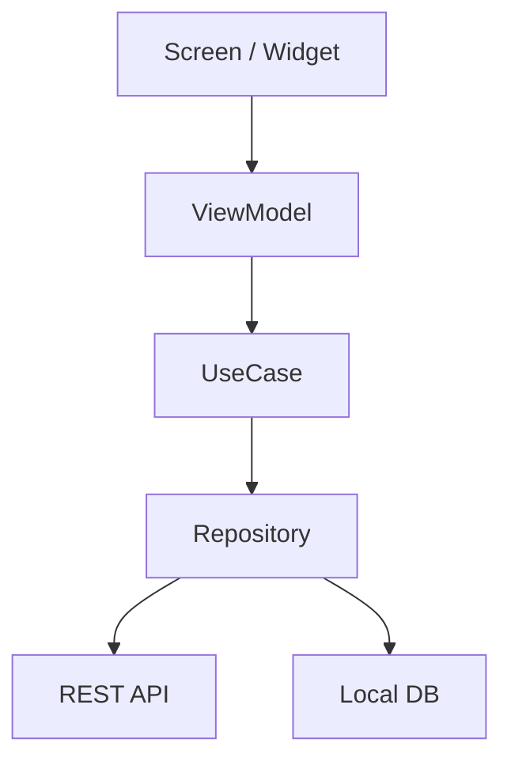

# 모바일 앱 아키텍처 패턴

## 1. Layered Architecture (가장 보편적)

```
Presentation → Application → Domain → Data
```

- 각 레이어는 **아래 방향**으로만 의존
- 테스트 쉬움, 변경 영향 명확

## 2. MVVM (Presentation 영역에서 자주)

```
View ← bind → ViewModel ← uses → Model/Service
```

- Flutter: `Provider`, `Riverpod`, `BLoC`
- React Native: `Zustand`, `Redux Toolkit`, `MobX`
- Android: `ViewModel` + `StateFlow`
- iOS: `@StateObject` + `ObservableObject`

## 3. Clean Architecture (큰 프로젝트)

```
UI → UseCase → Entity ← Repository ← DataSource
```

- 의존성 역전 원칙(DIP)
- 학습 비용 있지만 장기 유지보수 우수

## 어떤 패턴을 고를까

| 프로젝트 규모 | 권장 |
|---|---|
| 5화면 미만, 단순 | Layered + MVVM |
| 10화면 이상, 외부 연동 다수 | Layered + MVVM (엄격) |
| 장기 운영, 팀 5인 이상 | Clean Architecture |

> 본 프로젝트(7주)는 **Layered + MVVM** 권장.

## 의존성 주입 (DI)

| 플랫폼 | DI 도구 |
|---|---|
| Flutter | `get_it`, `riverpod`, `provider` |
| React Native | Context API, `react-query` |
| Android | Hilt (Dagger) |
| iOS | manual constructor injection |

## 다이어그램 예시 (Mermaid)



> AI Agent에게 "위 형태로 우리 프로젝트 다이어그램 그려줘" 라고 시키세요.
